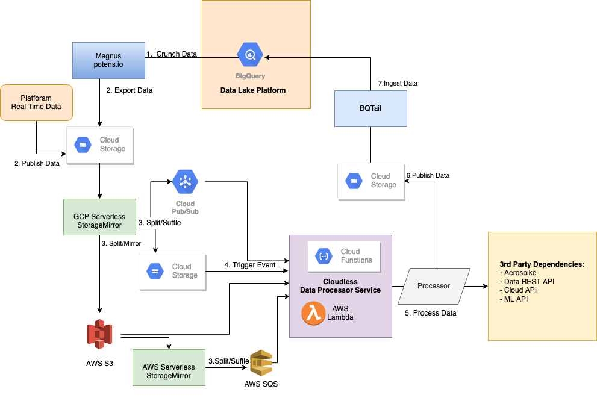

# Cloud data processor

- [Motivation](#motivation)
- [Introduction](#introduction)
   * [Serverless Restriction](#serverless-resource-restriction)
   * [Error handling](#error-handling)
- [Usage](#usage)
   * [Basic data processor](#basic-data-processor)
   * [Pre/Post data processor](#prepost-data-processor)
   * [Extending reporter](#extending-reporter)
- [Configuration](#configuration)   
- [Adepters](#adapters)
   * [S3 Event](#s3-event)
   * [SQS Event](#sqs-event)
   * [Google Storage Event](#google-storage-event)
   * [Google Pub/Sub Event](#google-pubsub-event)

## Motivation

On building serverless data processing solution architecture engineering team, 
noticed shared pattern across many deliverables. For example all input 
data uses new lime delimited data format, that need to be process in parallel.
Since we use serverless runtime (lambda/cloud functions) we need ability to recover 
from error, timeout, max allocated execution time restricted by cloud provider. 
We also need to control number of retries to avoid cloud functions explosion.
This project while addressing all these concerns, also reduce boilerplate code, 
increase productivity by reusing and maintaining shared data flow logic in place. 
This project is entry point agnostic, so it can run with any serverless architecture 
or even in stand-alone mode.

## Introduction

[](../../images/data_processing.png)

In our system Cloud Serverless stack leverages processing hundreds of TB data daily, typical data flow 
looks like following:
1. Crunching BigData with [Magnus](https://potens.io/products/#magnus) workflow system.
2. Exporting the crunched data from BigQuery to Google Cloud Storage or Publishing Real Time data to Google Cloud Storage to trigger [Storage Mirror](https://github.com/viant/smirror#rule) rule
3. [Storage Mirror](https://github.com/viant/smirror) transfers data to S3 or splits into smaller data chunk that can be comfortably handled by Serverless runtime (Lambda/Cloud Function).
4. [Storage Mirror](https://github.com/viant/smirror) trigger data processing event, by cloud storage upload or message bus push
5. Data processing takes place, typical processing includes:
    - Publishing data to aerospike
    - Calling Data/Cloud/ML API to enrich processing data
    - Taking data from 3rd party source to load it to BigQuery
6. Optionally processed data is publish to Google Storage to trigger [BQTail](https://github.com/viant/bqtail/blob/master/tail/README.md#data-ingestion-rules) ingestion rules.
7. [BqTail](https://github.com/viant/bqtail) ingest data to BigQuery.

This project defines generic data processing service.

### Serverless resource restriction

Cloud serverless runtime comes with resource restriction, typical include:
- max function duration
- max function memory
- max event size
- rate limits (i.e. DNS lookup)
- max throughput of incoming events

All of these has to be account for when implementing data processor.


Assume you have 1M items to process, but your serverless function has only fixed number of  minutes
allocated for execution. Given these, data processor service allows your to specify 
config.DeadlineReductionMs, that control max internal processing time, after which 
all unprocessed items will get written to the dedicated retry destination. 

Imagine that you keep retrying but never succeed to process even one item due to 3rd party datastore timeout, 
in that case instead of overloading number of serverless function instances, you want to control maximum retries. 
Once max retries is reached retry data get moved to the failed dedicated destination.

**Note that** you can control size or number of items in data processor trigger event (storage/message bus)
by using storage mirror split rule, which divide original large data file in many small chunks, either
uploaded to cloud storage or published to a message bus.

### Error handling

When processing data,  all valid items needs to get processed 
or rewritten to the retry destination in case of recoverable error or timeout.
All errors except DataCorruption  are recoverable, in case of detecting invalid data
just return [DataCorruption](error.go#L3) error.
```go
aNumber, err := toolbox.ToInt(item) //expected int
if err != nil {
    return processor.NewDataCorruption(fmt.Sprintf("invalid number: %s, %v", item, err))
}
```

Sometime data processing can result in the incomplete state. For example for one data record processor 
calls various independent APIs, while some may failed other are success, in that case, you can use PartialRetry error, 
providing only remaining portion of record which still need to be reprocess.


All corrupted and retry data can be written to dedicated locations, specified by:
- config.RetryURL
- config.FailedURL
- config.CorruptionURL

## Usage

#### Basic data processor 

The following example show how to implements basic processor

```go
package mypackage

import (
	"encoding/json"
	"context"
	"fmt"
	"github.com/viant/afs"
	"github.com/viant/cloudless/data/processor"
	"github.com/viant/toolbox"
	"strings"
	"sync/atomic"
)

type sumKeyType string
const sumKey = sumKeyType("sum")

//SumProcessor represents sum processor
type SumProcessor struct{}

//Process sums supplied data
func (p SumProcessor) Process(ctx context.Context, data []byte, reporter processor.Reporter) error {
	if len(data) == 0 {
		return nil
	}
	value := ctx.Value(sumKey)
	sum := value.(*int64)
	aNumber, err := toolbox.ToInt(string(data))
	if err != nil {
		return processor.NewDataCorruption(fmt.Sprintf("invalid number: %s, %v", data, err))
	}
	atomic.AddInt64(sum, int64(aNumber))
	return nil
}

func ExampleService_Do() {
	service := processor.New(&processor.Config{
		RetryURL: "mem://localhost/trigger",
		CorruptionURL: "mem://localhost/corrupted",
		FailedURL: "mem://localhost/failed",
        Concurrency: 5,
	}, afs.New(), &SumProcessor{}, processor.NewReporter)
	sum := int64(0)
	ctx := context.WithValue(context.Background(), sumKey, &sum)
	reporter := service.Do(ctx, processor.NewRequest(strings.NewReader("1\n2\n3\n5\nasd\n373\n23"),
		nil,
		"mem://localhost/data/numbers.txt"))
	fmt.Printf("Sum: %v\n", sum)
	//Prints sum 407
	data, _ := json.Marshal(reporter)
	/* Prints
	{
		"CorruptionErrors": 1,
		"CorruptionURL": "mem://localhost/corrupted/data/numbers.txt",
		"Errors": [
			"invalid number: asd, strconv.ParseInt: parsing \"asd\": invalid syntax"
		],
		"Loaded": 7,
		"Processed": 6,
		"ProcessingErrors": 0,
		"RetryErrors": 0,
		"RetryURL": "mem://localhost/retry/data/numbers-retry01.txt",
		"RuntimeMs": 1,
		"Status": "ok"
	}
	 */
}
```

#### Pre/Post data processor 

Custom data process can optionally implement Pre and Post method to initialise 
resources for actual processing and releasing resources and finalizing data processing.

The following example initialise sum, and uploads final sum to the destinationURL

```go
//SumProcessor represents sum processor
type SumProcessor struct{}

//Pre runs preprocessing logic
func (p *SumProcessor) Pre(ctx context.Context, reporter Reporter) (context.Context, error) {
	var sum int32
	return context.WithValue(ctx, sumKey("sum"), &sum), nil
}

//Process sums supplied data
func (p SumProcessor) Process(ctx context.Context, data []byte, reporter processor.Reporter) error {
    //...
    return nil
}

func (p *sumProcessor) Post(ctx context.Context, reporter Reporter) error {
	destURL := reporter.BaseResponse().DestinationURL
	if destURL != "" {
		value := ctx.Value(sumKey("sum"))
		sum := value.(*int32)
		if err := p.fs.Upload(ctx, destURL, file.DefaultFileOsMode, strings.NewReader(fmt.Sprintf("%v", *sum))); err != nil {
			return err
		}
	}
	return nil
}
```

The following example shows simple CSV to JSON transformer processor

```go
package mypackage
import (
	"bytes"
	"context"
	"encoding/csv"
	"fmt"
	"github.com/viant/cloudless/data/processor"
	"github.com/viant/cloudless/data/processor/destination"
	"github.com/viant/tapper/log"
	"github.com/viant/tapper/msg"
	"strings"
)

//Transformer transform csv into JSON
type Transformer struct {
	msgProvider *msg.Provider
}

//Pre initialize data logger for config.DestinationURL 
func (p Transformer) Pre(ctx context.Context, reporter processor.Reporter) (context.Context, error) {
	return destination.NewDataLogger(ctx, reporter)
}

//Process transform CSV into JSON
func (p Transformer) Process(ctx context.Context, data []byte) error {
	if len(data) == 0 {
		return nil
	}
	csvReader := csv.NewReader(bytes.NewReader(data))
	record, err := csvReader.Read()
	if err == nil && len(record) < 3 {
		err = fmt.Errorf("invalid record size, expected 3 but had: %v", len(record))
	}
	if err != nil {
		return processor.NewDataCorruption(fmt.Sprintf("failed to read record: %s, %v", data, err))
	}
	message := p.msgProvider.NewMessage()
	defer message.Free()
	message.PutString("ID", record[0])
	message.PutString("Region", record[1])
	message.PutStrings("SegmentIDS", strings.Split(record[2], ","))
	logger := ctx.Value(destination.DataLoggerKey).(*log.Logger)
	return logger.Log(message)
}

//Post closes logger and finalize data upload to the data destination
func (p Transformer) Post(ctx context.Context, reporter processor.Reporter) error {
	logger := ctx.Value(destination.DataLoggerKey).(*log.Logger)
	return logger.Close()
}

//NewTransformer creates a new transformer
func NewTransformer() *Transformer {
	return &Transformer{
		msgProvider: msg.NewProvider(16*1024, 20),
	}
}
```

#### Extending reporter 

Reporter encapsulate Response and processing metrics reported to serverless standard output (cloud watch/stack driver)

The following example shows how to use extend BaseReporter with additional metrics.
    
```go
//URLReporter represents URL reporeter
type URLReporter struct {
	processor.BaseReporter
	ByResponseCode map[int]int
	mutex          sync.Mutex
}

//NewURLReporter represents URL reporeter
func NewURLReporter() processor.Reporter {
	return  &URLReporter{
		ByResponseCode: make(map[int]int),
		BaseReporter: processor.BaseReporter{
			Response: &processor.Response{Status: processor.StatusOk},
		},
	}
}

type HTTPProcessor struct {
	BaseURL string
}

func (p HTTPProcessor) Process(ctx context.Context, data []byte, reporter processor.Reporter) error {
	urlReporter := reporter.(*URLReporter)
	URL := p.BaseURL + string(data)
	request, err := http.NewRequestWithContext(ctx, http.MethodGet, URL, nil)
	if err != nil {
		return processor.NewDataCorruption(fmt.Sprintf("invalid request: %v", URL))
	}
	response, err := http.DefaultClient.Do(request)
	if err != nil {
		return err
	}
	urlReporter.mutex.Lock()
	defer urlReporter.mutex.Unlock()
	urlReporter.ByResponseCode[response.StatusCode]++
	return nil
}

func ExampleService_Do() {
	ctx := context.Background()
	service := processor.New(&processor.Config{
		CorruptionURL: "mem://localhost/corrupted",
		RetryURL:      "mem://localhost/retry",
		FailedURL:     "mem://localhost/failed",
	}, afs.New(), &HTTPProcessor{BaseURL: "http://mydataexporter/enrich/?data="}, NewURLReporter)
	reporter := service.Do(ctx, processor.NewRequest(strings.NewReader(""),
		nil,
		"mem://localhost/response/numbers.txt"))
	response, _ := json.Marshal(reporter)
	fmt.Printf("%s\n", response)
}
```


## Configuration

Data process service supports the following configuration options:
 - **DeadlineReductionMs**  defines time to rewrite unprocess data to retry location, 1% of event max execution time by default
 - **MaxRetries**  defines max retries, once max retries is exceeded retry data get written to the failed destination. 
 - **Concurrency** number of go routines running processor.Process logic.
 - **DestinationURL** optional data destination URL
 - **RetryURL** retry data destination, it should be the source for the data processor trigger event.
 - **FailedURL** retry data failed destination (original data get never lost but requires manual intervention)
 - **CorruptionURL** destination for corrupted data (to manually inspect issue)
 - **MaxExecTimeMs** optional parameter for runtimes where context does not come with the deadline

All configuration URL support the following macro substitution:
 - $UUID: expands with random UUID
 - $TimePath: expaned with request.StartTime in the following format: yyyy/MM/dd/hh
 
## Known Limitation 

 - Concurrency setting
 - EOF error
 - Memory exceeded limit
 
 
 
## Adapters

Adapter provides convenient way to create data processing request from various cloud serverless events.

#### S3 Event
  
```go
package main

import (
	"context"
	"encoding/json"
	"fmt"
	"github.com/aws/aws-lambda-go/lambda"
	"github.com/viant/afs"
	_ "github.com/viant/afsc/s3"
	"github.com/viant/cloudless/data/processor"
	"github.com/viant/cloudless/data/processor/adapter/aws"
)

func main() {
    lambda.Start(handleEvent)
}

func handleEvent(ctx context.Context, event aws.S3Event) error {
	fs := afs.New()
	var service processor.Service //... get service singleton instance
	request, err := event.NewRequest(ctx, fs, service.Config)
	if err != nil {
		return err
	}
	reporter := service.Do(ctx, request)
	JSON, _ := json.Marshal(reporter)
	fmt.Printf("%s\n", JSON)
	return nil
}

```

#### SQS Event

```go
package main

import (
	"context"
	"encoding/json"
	"fmt"
	_ "github.com/viant/afsc/s3"
	"github.com/aws/aws-lambda-go/lambda"
	"github.com/viant/cloudless/data/processor"
	"github.com/viant/cloudless/data/processor/adapter/aws"
)

func main() {
    lambda.Start(handleEvent)
}

func handleEvent(ctx context.Context, event aws.SQSEvent) error {
	 var service processor.Service //... get service singleton instance
	request, err := event.NewRequest()
	if err != nil {
		return err
	}
	reporter := service.Do(ctx, request)
	JSON, _ := json.Marshal(reporter)
	fmt.Printf("%s\n", JSON)
	return nil
}
```

#### Google Storage Event

```go
package mypacakge

import (
	"context"
	"encoding/json"
	"fmt"
	"github.com/viant/afs"
	_ "github.com/viant/afsc/gs"
	"github.com/viant/cloudless/data/processor"
	"github.com/viant/cloudless/data/processor/adapter/gcp"
)
//HandleEvent handles cloud function storage event
func HandleEvent(ctx context.Context, event gcp.GSEvent) error {
	fs := afs.New()
    var service processor.Service //... get service singleton instance
    	request, err := event.NewRequest(ctx, fs, service.Config)
	if err != nil {
		return err
	}
	reporter := service.Do(ctx, request)
	JSON, _ := json.Marshal(reporter)
	fmt.Printf("%s\n", JSON)
	return nil	
}
```

#### Google Pub/Sub Event
```go
package mypackage

import (
	"context"
	"encoding/json"
	"fmt"
	_ "github.com/viant/afsc/gs"
	"github.com/viant/cloudless/data/processor"
	"github.com/viant/cloudless/data/processor/adapter/gcp"
)
//HandleEvent handles cloud function pubsub event
func HandleEvent(ctx context.Context, event gcp.PubSubMessage) error {
	var service processor.Service //... get service singleton instance
	request, err := event.NewRequest()
	if err != nil {
		return err
	}
	reporter := service.Do(ctx, request)
	JSON, _ := json.Marshal(reporter)
	fmt.Printf("%s\n", JSON)
	return nil
}
```

## End to end testing

- TODO add to the examples 

